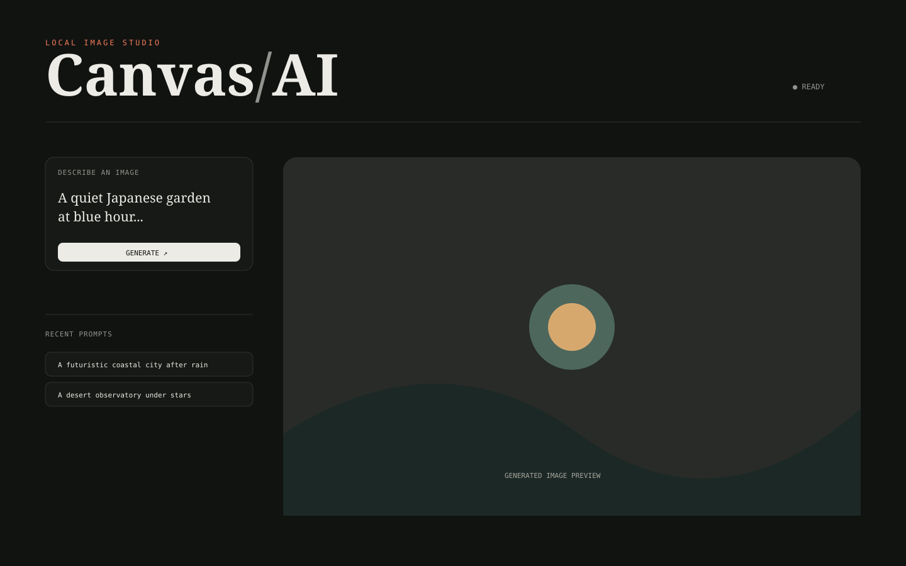

# Canvas AI — Pollinations Image Studio



A cool, minimal local browser interface for the supplied **Simple Image Generator (Pollinations)** n8n workflow.

## Run

Requires Node.js 18+.

```powershell
cd pollinations-image-studio
node server.js
```

Open http://localhost:3002.

## What it does

The original workflow accepts `chatInput` and requests an image from Pollinations. This project keeps that behavior and adds a local backend proxy, prompt history, square/landscape/portrait sizing, download, copy-link, keyboard generation with Ctrl/Cmd+Enter, responsive layout, and automatic system dark mode.

## API

`GET /api/image?prompt=...&width=1024&height=1024` proxies the generated image. Width and height are constrained to safe local UI limits.

## Release

Version `1.0.0` — local browser studio.

Read more in [ABOUT.md](ABOUT.md), [docs/architecture.md](docs/architecture.md), [docs/workflow.md](docs/workflow.md), and [docs/release.md](docs/release.md).
